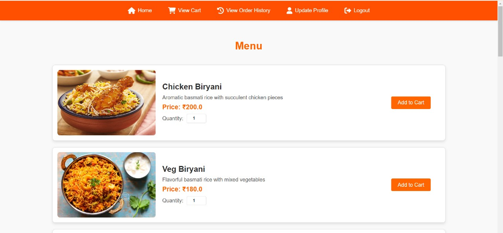

# FoodPort - Food Delivery Application

FoodPort is an online food delivery application that allows users to browse restaurants, add items to their cart, and place orders. It provides a seamless experience for users to manage their food orders with an intuitive interface and an easy checkout process.

## Features
- **User Registration & Login**: Users can sign up and log in to the system.
- **Restaurant and Menu Browsing**: Users can explore different restaurants and their menu items.
- **Cart Management**: Users can add, update, and remove items from their cart.
- **Order History**: Users can view their past orders and order details.
- **Payment & Checkout**: Users can proceed with payment and confirm orders.
- **Profile Management**: Users can update their profile details.

## Technologies Used
- Java
- Servlet & JSP
- MySQL
- CSS & HTML
- JavaScript

## Screenshots
Here are some screenshots of the application:

**Welcome Page**: This is the Welcome Page.

**Sign In Page**: The login page for users to sign in.

**Sign Up Page**: The registration page for new users.

**Home Page**: The main page displaying the list of restaurants.

**Menu Page**: Displays the menu of a selected restaurant.

**Cart Page**: The shopping cart where users can view and manage their items.

**Order History**: View past orders and their details.

**Payment Page**: The checkout page where users can make payments.

**Profile Update Page**: Users can update their profile details.

## License
This project is licensed under the MIT License - see the [LICENSE](LICENSE) file for details.
